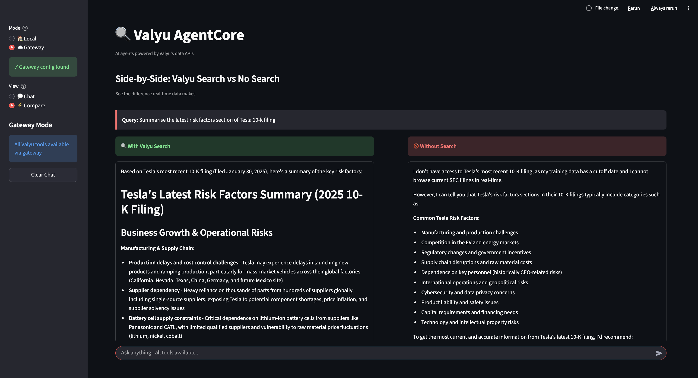
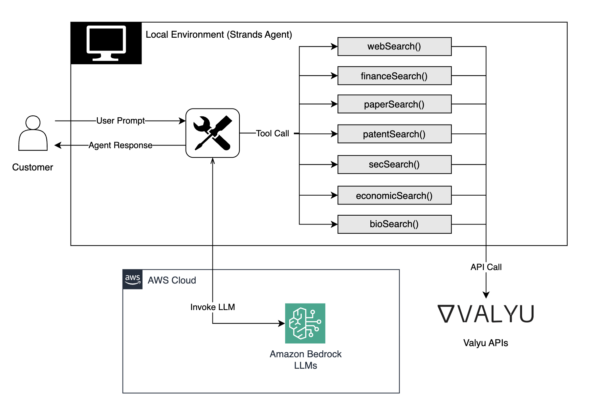
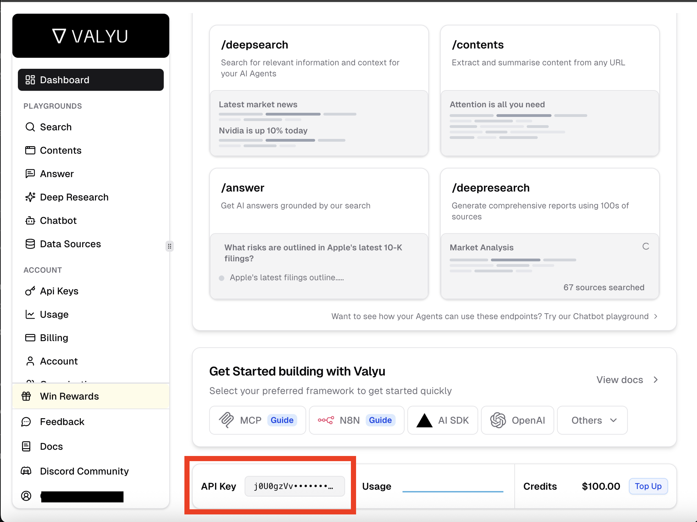
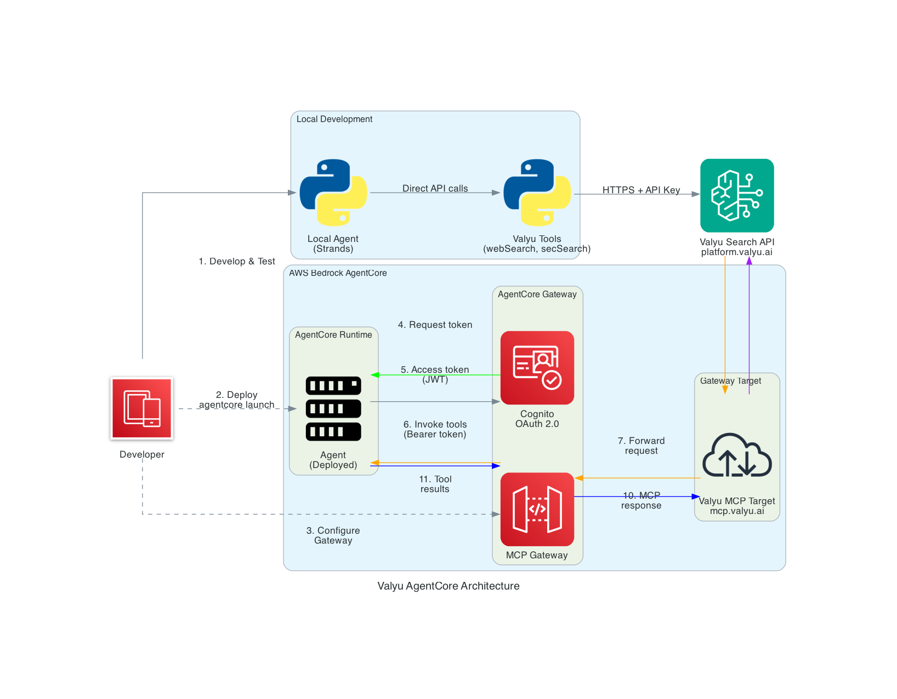

# valyu-agentcore

**Valyu search tools for AWS Bedrock AgentCore and Strands Agents.**

Add web search, SEC filings, financial data, academic papers, patents, and biomedical research to your [AWS Bedrock AgentCore](https://docs.aws.amazon.com/bedrock/latest/userguide/agentcore.html) and [Strands](https://strandsagents.com) agents.

Valyu is the [leading search API for AI agents](https://www.valyu.ai/blogs/benchmarking-search-apis-for-ai-agents).



## Architecture



The agent runs locally (or on AWS Runtime) and uses Valyu tools to search across web, finance, SEC filings, academic papers, patents, and biomedical data. LLM inference is powered by Amazon Bedrock.

## Installation

```bash
uv init
```

```bash
uv add valyu-agentcore
```

For AgentCore Gateway support:
```bash
uv add valyu-agentcore[agentcore]
```

## Quick Start

### Local Development

Use Valyu tools directly with Strands Agents:

```python
from valyu_agentcore import webSearch, financeSearch, secSearch
from strands import Agent
from strands.models import BedrockModel

agent = Agent(
    model=BedrockModel(model_id="us.anthropic.claude-sonnet-4-20250514-v1:0"),
    tools=[webSearch(), financeSearch(), secSearch()],
)

response = agent("Summarize Tesla's latest 10-K risk factors")
```

Get your API key at [platform.valyu.ai](https://platform.valyu.ai).  


### Production: AgentCore Gateway + Runtime


**Architecture Flow:**
1. **Local Development**: Developers can build and tests agent locally with direct API calls to Valyu
2. **Deploy Runtime**: Agent can be deployed to AgentCore Runtime via `agentcore launch`
3. **Configure Gateway**: Developers can set up Gateway with Valyu MCP target
4. **Authentication**: Runtime requests access token from Cognito
5. **Token Response**: Cognito returns JWT access token
6. **Tool Invocation**: Runtime calls Gateway with Bearer token
7. **Request Forward**: Gateway forwards request to Valyu MCP target
8. **API Query**: MCP target makes search query to Valyu API
9. **Search Results**: Valyu API returns search results
10. **MCP Response**: MCP target formats response back to Gateway
11. **Final Results**: Gateway returns tool results to Runtime agent


For production, deploy to AWS with centralized tool access:

```
User → AgentCore Runtime → AgentCore Gateway → Valyu MCP
```

```bash
# 1. Set up Gateway with Valyu tools
cd examples/gateway
export VALYU_API_KEY=your-key
python setup_gateway.py

# 2. Deploy agent to Runtime
cp valyu_gateway_config.json ../runtime/
cd ../runtime
agentcore configure --entrypoint agent.py --non-interactive --name myagent
agentcore launch

# 3. Test it
agentcore invoke '{"prompt": "What is NVIDIA stock price?"}'
```

**Why this architecture?**
- Centralized secrets (API key in Gateway, not in code)
- CloudTrail audit logging
- OAuth authentication
- Serverless scaling

See [examples/runtime/](examples/runtime/) for complete walkthrough.

## Demo UI

Try the interactive Streamlit demo to explore all features:

```bash
# Set your API key
export VALYU_API_KEY=your-key

# Run the demo
streamlit run examples/app.py
```

**Features:**
- **Local Mode** - Direct API calls to Valyu
- **Gateway Mode** - Route through AWS AgentCore Gateway
- **Runtime Mode** - Serverless execution on AWS

**Agents:**
- Single-tool agents: Web, Finance, SEC, Academic, Patents, Biomedical, Economics
- Multi-tool agents: Financial Analyst, Research Assistant, Due Diligence

**Views:**
- **Chat** - Standard chat interface
- **Compare** - Side-by-side comparison: with Valyu search vs without

## Available Tools

| Tool | Description | Best For |
|------|-------------|----------|
| `webSearch` | Web search with full page content | News, current events, general info |
| `financeSearch` | Stock prices, earnings, market data | Financial analysis, market research |
| `paperSearch` | Academic papers (arXiv, PubMed, journals) | Literature review, research |
| `bioSearch` | Clinical trials, FDA labels, biomedical | Medical research, drug info |
| `patentSearch` | USPTO patents and IP | Prior art, IP research |
| `secSearch` | SEC filings (10-K, 10-Q, 8-K) | Company analysis, due diligence |
| `economicsSearch` | BLS, FRED, World Bank data | Economic indicators, policy research |

## Use Case Examples

Real-world agent examples in [examples/use_cases/](examples/use_cases/):

| Example | Description | Tools Used |
|---------|-------------|------------|
| [Financial Analyst](examples/use_cases/financial_analyst.py) | Investment research and analysis | SEC, finance, web |
| [Research Assistant](examples/use_cases/research_assistant.py) | Academic literature review | papers, patents, web |
| [Due Diligence](examples/use_cases/due_diligence.py) | M&A and investment evaluation | All tools |

```bash
# Run financial analyst
python examples/use_cases/financial_analyst.py "Analyze NVIDIA's competitive position"

# Run research assistant
python examples/use_cases/research_assistant.py "transformer architecture improvements"

# Run due diligence
python examples/use_cases/due_diligence.py "Stripe"
```

See [examples/local/](examples/local/) for individual tool examples.

## Tool Examples

### webSearch

```python
from valyu_agentcore import webSearch

agent = Agent(
    model=BedrockModel(model_id="us.anthropic.claude-sonnet-4-20250514-v1:0"),
    tools=[webSearch()],
)
response = agent("Latest news on quantum computing breakthroughs")
```

### financeSearch

```python
from valyu_agentcore import financeSearch

agent = Agent(
    model=BedrockModel(model_id="us.anthropic.claude-sonnet-4-20250514-v1:0"),
    tools=[financeSearch()],
)
response = agent("What is NVIDIA's current stock price and P/E ratio?")
```

### secSearch

```python
from valyu_agentcore import secSearch

agent = Agent(
    model=BedrockModel(model_id="us.anthropic.claude-sonnet-4-20250514-v1:0"),
    tools=[secSearch()],
)
response = agent("Summarize the risk factors from Apple's latest 10-K")
```


## Use All Tools

```python
from valyu_agentcore import ValyuTools

tools = ValyuTools(max_num_results=5)

agent = Agent(
    model=BedrockModel(model_id="us.anthropic.claude-sonnet-4-20250514-v1:0"),
    tools=tools.all(),  # All 7 tools
)

# Or use tool groups:
# tools.search_tools()     - All search tools
# tools.financial_tools()  - finance, SEC, economics, company research
# tools.research_tools()   - papers, bio, patents
```

## Configuration

All tools accept these options:

```python
from valyu_agentcore import webSearch

tool = webSearch(
    api_key="your-key",           # Or use VALYU_API_KEY env var
    max_num_results=10,           # Number of results (default: 5)
    max_price=0.50,               # Max cost per query in dollars
    relevance_threshold=0.7,      # Filter by quality (0-1)
    excluded_sources=["reddit.com"],  # Exclude specific domains
)
```

## AgentCore Gateway

### Add to Existing Gateway

If you already have an AgentCore Gateway:

```python
from valyu_agentcore.gateway import add_valyu_target

# Add Valyu tools to your gateway
result = add_valyu_target(
    gateway_id="your-gateway-id",
    region="us-east-1",  # optional
)
print(f"Added target: {result['target_id']}")
```

Your existing agents will now have access to all Valyu tools through the gateway.

### Create New Gateway

For testing or new deployments:

```python
from valyu_agentcore.gateway import setup_valyu_gateway, GatewayAgent

# Create gateway with Cognito auth (one-time)
config = setup_valyu_gateway()

# Use the agent
with GatewayAgent.from_config() as agent:
    response = agent("Search for NVIDIA SEC filings")
    print(response)
```

### CloudFormation Deployment

Deploy authentication infrastructure via CloudFormation:

```bash
aws cloudformation create-stack \
  --stack-name valyu-gateway \
  --template-body file://cloudformation/valyu-gateway.yaml \
  --parameters ParameterKey=ValyuApiKey,ParameterValue=YOUR_KEY \
  --capabilities CAPABILITY_NAMED_IAM
```

This creates Cognito, IAM, and logging infrastructure. Then create your gateway and add Valyu as a target. See [cloudformation/](cloudformation/) for full instructions.

### IAM Policies

Ready-to-use IAM policies in [iam-policies/](iam-policies/):

- **agentcore-user-policy.json** - Full gateway management access
- **agentcore-invoke-only-policy.json** - Minimal invoke-only access

### Manual Console Setup

You can also add Valyu via AWS Console:

1. Go to **Amazon Bedrock** > **AgentCore** > **Gateways**
2. Select your gateway > **Add target**
3. Configure:
   - Name: `valyu-search`
   - Type: MCP server
   - Endpoint: `https://mcp.valyu.ai/mcp?valyuApiKey=YOUR_KEY`

### Gateway Tools

Tools available through the gateway:

| Gateway Tool | Description |
|--------------|-------------|
| `valyu_search` | Web search |
| `valyu_academic_search` | Academic papers |
| `valyu_financial_search` | Financial data |
| `valyu_sec_search` | SEC filings |
| `valyu_patents` | Patent search |
| `valyu_contents` | URL content extraction |

See [examples/gateway/README.md](examples/gateway/README.md) for complete documentation.

## Project Structure

```
valyu-agentcore/
├── valyu_agentcore/         # Core package
│   ├── tools.py             # Strands Agent tools
│   └── gateway.py           # AgentCore Gateway integration
├── examples/
│   ├── app.py               # Streamlit demo UI
│   ├── local/               # Direct Strands usage
│   ├── runtime/             # AgentCore Runtime deployment
│   ├── gateway/             # AgentCore Gateway setup
│   └── use_cases/           # Real-world agent examples
├── assets/                  # Images and diagrams
├── cloudformation/          # AWS CloudFormation templates
└── iam-policies/            # IAM policy templates
```

## Create Custom Tools

Build your own tool using the Valyu API:

```python
import os
import httpx
from strands.tools import tool

@tool
def my_custom_search(query: str) -> dict:
    """Search for specific content."""
    response = httpx.post(
        "https://api.valyu.ai/v1/deepsearch",
        headers={"x-api-key": os.environ["VALYU_API_KEY"]},
        json={
            "query": query,
            "search_type": "all",
            "included_sources": ["your-sources"],
        },
    )
    return response.json()
```

## Links

- [Valyu Platform](https://platform.valyu.ai) - Get API keys ($10 free credits)
- [Valyu Documentation](https://docs.valyu.ai) - API docs
- [Strands Agents](https://strandsagents.com) - Agent framework
- [AWS Bedrock AgentCore](https://docs.aws.amazon.com/bedrock/latest/userguide/agentcore.html) - AWS docs

## License

MIT
